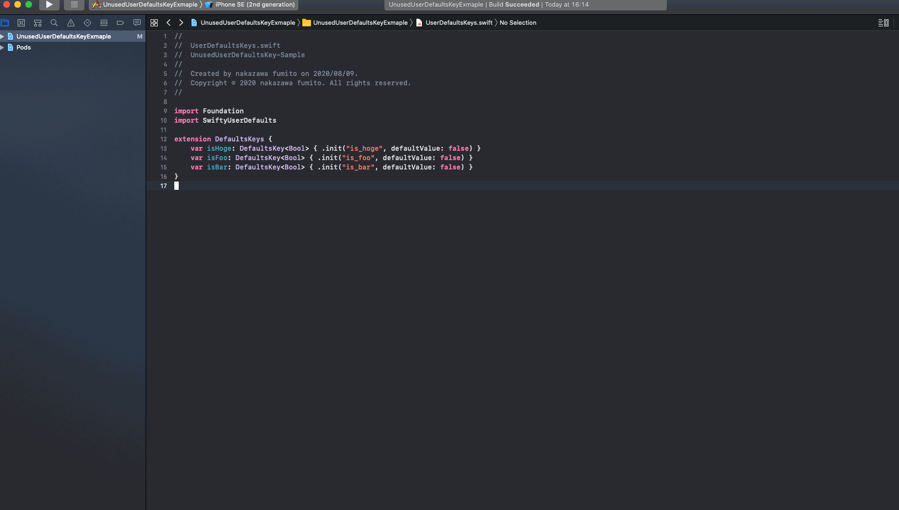
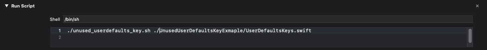

An example project with unnecessary UserDefaultsKey management

## GIF


## How to work on your project
1. Create `.unused_userdefaults_key`

Example
```.unused_userdefaults_key
is_hoge
is_foo
```

2. Copy `unused_userdefaults_key.sh` to your project folder
3. Run `unused_userdefaults_key.sh` in `Build Phases`

4. Build your project :tada:

## Contact
If you discover problem or have opinions, please let me know through Github issues💁‍♂️

## Author
funzin
- mail: nakazawa.fumito@gmail.com

## License
UnusedUserDefaultsKeyExmaple is available under the MIT license. See the [LICENSE](./LICENSE) file for more info.
